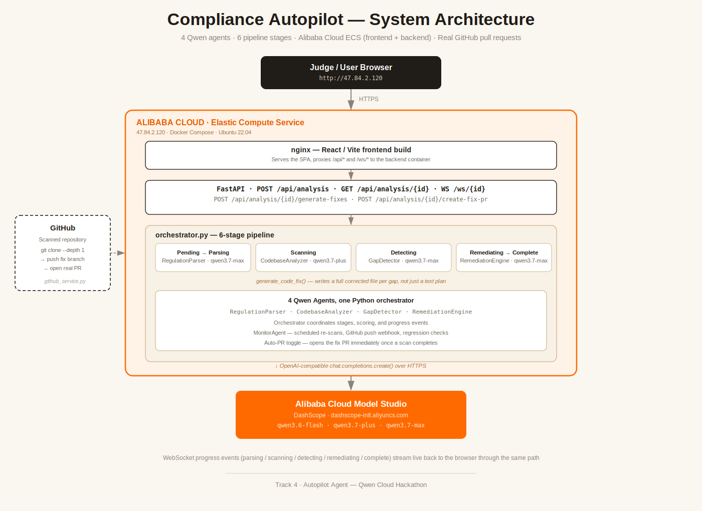
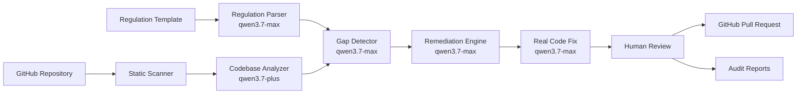

# Compliance Autopilot

<div align="center">

### Scan a repository, find real compliance gaps, generate a real code fix, and ship it as a real GitHub pull request.

[](https://fastapi.tiangolo.com)
[](https://react.dev)
[](https://www.alibabacloud.com/en/solutions/generative-ai/qwen)
[](https://www.alibabacloud.com)
[](https://www.docker.com)

**Built for the Qwen Cloud Hackathon — Track 4: Autopilot Agent**

[Quick Start](#quick-start) | [Demo](#demo) | [Architecture](#architecture) | [Tech Stack](#tech-stack)

</div>

---

## At A Glance

| Item | Details |
|---|---|
| Track | Track 4: Autopilot Agent |
| Live demo | http://47.84.2.120/ |
| YouTube demo video | _add link here once recorded_ |
| Qwen Cloud layer | `qwen3.7-max`, `qwen3.7-plus`, `qwen3.6-flash` via DashScope |
| Alibaba Cloud proof | [`backend/app/api/system.py`](backend/app/api/system.py) — `/api/deployment-proof`, deployed on Alibaba Cloud ECS |
| Architecture diagram | [`docs/architecture-diagram.svg`](docs/architecture-diagram.svg) |
| Core hook | Real scan → real generated code fix → human review, or a real GitHub pull request |
| Stack | FastAPI, React, SQLite, Qwen Cloud, Docker, Alibaba Cloud ECS |

## The Problem

Companies must follow real data protection laws — GDPR, PSD2, BaFin, and many
country-specific rules. Manual compliance review is slow, expensive, and goes
stale the moment the code changes. Most compliance tools stop at a text
report: they tell a team what's wrong but leave the actual fix as homework.

## The Solution

Compliance Autopilot runs the whole loop, not just the audit:

```text
Pick a repository, industry, and country
  -> load a source-backed regulation (GDPR, PSD2, BaFin, or a pasted policy)
  -> clone and scan the real code
  -> find real compliance gaps, with the exact file and line
  -> generate a real corrected file for each gap (not just a text plan)
  -> a human reviews the diff, or approves it
  -> the fix ships as a real GitHub pull request
```

The workflow stays human-in-the-loop by default — remediation stays pending
until a reviewer approves it — but a project can also opt into **Auto-PR**,
which opens the fix pull request the moment a scan completes.

## Demo

1. Open the dashboard and click **New Scan**.
2. **Industry** — Banking & FinTech, Entertainment & Media, or Shipping & Logistics.
3. **Geography** — pick a continent and country; a source-backed rule pack loads from the backend.
4. **Codebase** — pick a bundled demo codebase, or switch to **My repository** and paste a public GitHub URL.
5. **Launch** — the live pipeline clones the repo and streams `RegulationParser -> CodebaseAnalyzer -> GapDetector -> RemediationEngine` progress over WebSockets.
6. Land on the **Fix Issues** page: review the findings, click **Generate Fixes** to get a real corrected file per gap, and preview the diff.
7. Approve remediation, then either stay in **Review code** mode, or switch to **Create GitHub PR** and watch the fix land as a real pull request.
8. Open **Full Report** for the confidence score, requirement-by-requirement evidence, code audit view, regression check, and continuous-monitoring / Auto-PR controls.

For a fast judge walkthrough, the wizard's Banking, Shipping, and Entertainment
picks feature real, already-scanned open-source repositories (not synthetic
demo data) — see **Real-World Proof** below.

## Real-World Proof

The pipeline was validated against real open-source projects, not only
seeded demo data. Each of these found real gaps and shipped a real,
human-reviewable pull request:

| Repository | What it is | Real PR |
|---|---|---|
| [NodeGoat](https://github.com/adetorojeremiahfadesayo/NodeGoat-demo-testing) | OWASP Top 10 training app (Node.js) | [PR #7](https://github.com/adetorojeremiahfadesayo/NodeGoat-demo-testing/pull/7) |
| [Vulpy](https://github.com/adetorojeremiahfadesayo/vulpy-demo-testing) | Security-training app (Python/Flask) | [PR #1](https://github.com/adetorojeremiahfadesayo/vulpy-demo-testing/pull/1) |
| [Ghostfolio](https://github.com/adetorojeremiahfadesayo/ghostfolio-demo-testing) | Real production wealth-management app (TypeScript) | [PR #1](https://github.com/adetorojeremiahfadesayo/ghostfolio-demo-testing/pull/1) |
| [Navidrome](https://github.com/adetorojeremiahfadesayo/navidrome-demo-testing) | Real production music-streaming server (Go) | [PR #1](https://github.com/adetorojeremiahfadesayo/navidrome-demo-testing/pull/1) |

## Why Compliance Autopilot Stands Out

| Other compliance tools | Compliance Autopilot |
|---|---|
| A static checklist or text report | A live scan of the real, current codebase |
| Findings with no fix | A real corrected file generated per finding |
| "Here's what's wrong" | "Here's the diff — review it, or ship it" |
| Manual PR creation, if any | One click opens a real GitHub pull request |
| One-off audit | Scheduled re-scans, push webhooks, CI gate, live badge |
| Generic rules | Source-backed rule packs across 3 industries x 25 countries |

## Architecture





See [docs/ARCHITECTURE.md](docs/ARCHITECTURE.md) for the full agent breakdown, data flow, and deployment shape diagram.

## Qwen Cloud Integration

Every judgment-heavy step runs on Qwen Cloud through Alibaba Cloud's DashScope API:

| Agent | Model | Job |
|---|---|---|
| Regulation Parser | `qwen3.7-max` | Turns regulation text into structured technical requirements |
| Codebase Analyzer | `qwen3.7-plus` | Synthesizes the scanned repository into data flows, storage, and controls |
| Gap Detector | `qwen3.7-max` | Maps requirements to real code evidence |
| Remediation Engine | `qwen3.7-max` | Writes the remediation plan, and the real corrected file, per gap |

The DashScope endpoint and model configuration live in
[`backend/app/config.py`](backend/app/config.py). The Qwen client itself is
[`backend/app/services/qwen_client.py`](backend/app/services/qwen_client.py).
Every analysis stores the exact model names and token usage that produced it.

## GitHub Automation Integration

Real remediation only matters if it ships. Once a fix is generated and
approved, [`backend/app/services/github_service.py`](backend/app/services/github_service.py)
pushes the corrected files to a new branch and opens a real pull request
through the GitHub API — see the **Real-World Proof** table above for live
examples. A project can also enable:

- **Continuous monitoring** — scheduled re-scans on an interval.
- **GitHub push webhook** — triggers an immediate re-scan on every push.
- **Auto-PR** — skips the manual approval click and opens the fix PR the moment a scan completes (still a PR, never a direct push, so the merge button stays the final human checkpoint).
- **CI gate + README badge** — `GET /api/projects/{id}/ci-status` and `/api/projects/{id}/badge.svg`; see [docs/CI_INTEGRATION.md](docs/CI_INTEGRATION.md).

## Tech Stack

| Layer | Technology |
|---|---|
| Backend | Python, FastAPI, SQLAlchemy, Pydantic v2 |
| AI / LLM | Qwen Cloud (`qwen3.7-max`, `qwen3.7-plus`, `qwen3.6-flash`) via DashScope, OpenAI-compatible API |
| Database | SQLite (PostgreSQL-compatible design) |
| Frontend | React, Vite, React Router, Recharts, Lucide React |
| Real-time | WebSockets for live agent progress |
| Deployment | Docker, Docker Compose, Alibaba Cloud ECS, nginx |
| Source control automation | GitHub REST API (branches, pull requests) |

## Quick Start

```bash
git clone https://github.com/adetorojeremiahfadesayo/Compliance-AI-Scanner.git
cd Compliance-AI-Scanner
```

### Backend

Create `backend/.env`:

```env
DASHSCOPE_API_KEY=your_dashscope_api_key_here
DATABASE_URL=sqlite:///./compliance_autopilot.db
# Optional: enables the auto-fix PR feature (needs repo write access)
GITHUB_TOKEN=your_github_token
# Optional: gates the API behind a shared access token
API_ACCESS_TOKEN=
```

```bash
cd backend
python -m venv venv
.\venv\Scripts\activate
pip install -r requirements.txt
uvicorn app.main:app --reload
```

API docs: [http://localhost:8000/docs](http://localhost:8000/docs)

### Frontend

```bash
cd frontend
npm install
npm run dev
```

App: [http://localhost:5173](http://localhost:5173)

### Docker Compose

```bash
export DASHSCOPE_API_KEY=your-key   # Windows: set DASHSCOPE_API_KEY=your-key
docker-compose up --build
```

## Environment Variables

| Variable | Purpose |
|---|---|
| `DASHSCOPE_API_KEY` | Qwen Cloud API key (required for real scans) |
| `DATABASE_URL` | SQLAlchemy database URL — defaults to SQLite |
| `GITHUB_TOKEN` | Enables real branch pushes and pull request creation |
| `API_ACCESS_TOKEN` | Optional shared-token gate for a public deployment |
| `CLONE_BASE_DIR` | Where scanned repositories are cloned — point this at a mounted volume in production |

## Quality Checks

```bash
python -m pytest backend/tests -q
cd frontend && npm run build
```

## Continuous Compliance & CI

Every project gets a live compliance badge (`/api/projects/{id}/badge.svg`)
and a CI gate endpoint (`/api/projects/{id}/ci-status?threshold=60`). A
ready-made GitHub Actions workflow lives at
[examples/compliance-ci.yml](examples/compliance-ci.yml); setup details are
in [docs/CI_INTEGRATION.md](docs/CI_INTEGRATION.md).

## Production Readiness

This is a hackathon build, and we'd rather say that plainly than have it
discovered. What's already in place:

- Dockerized, deployed on Alibaba Cloud ECS, `restart: always`, environment-based config, backend tests, real WebSocket streaming, CI gate integration, and an audit log for every agent/human action.
- An optional shared-token API gate (`API_ACCESS_TOKEN`) so the deployment isn't callable by anyone who finds the URL.

What a production deployment would still need, in priority order:

1. **Real user accounts and per-user authorization**, not a single shared token.
2. **HTTPS termination** in front of the app (currently plain HTTP on the demo deployment).
3. **A managed database** (RDS/PostgreSQL) in place of SQLite, plus a real migration tool.
4. **Horizontal scaling** — today's deployment is a single ECS instance.
5. **Secrets management** (e.g. KMS-backed secrets) instead of a plain `.env` file on the host.

## Security

Never commit real API keys, GitHub tokens, or `.env` files. Use
[`backend/.env.example`](backend/.env.example) as the template.

## Hackathon Submission

See [docs/HACKATHON_SUBMISSION.md](docs/HACKATHON_SUBMISSION.md) for the
Devpost description, demo video script, Track 4 positioning, and Alibaba
Cloud deployment proof checklist.

## License

MIT. See [LICENSE](LICENSE).
