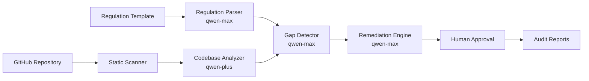

# Compliance Autopilot

Compliance Autopilot is a Qwen Cloud-powered regulatory compliance audit agent. It scans a software repository, translates GDPR-style regulation text into technical requirements, detects gaps in the codebase, generates remediation plans, streams progress in real time, and exports audit-ready Markdown reports.

The project is built for the **Qwen Cloud Hackathon Track 4: Autopilot Agent**.

## What It Does

1. Parses regulation text into structured requirements with `qwen-max`.
2. Scans repositories for PII fields, data storage, logging leaks, deletion logic, consent handling, encryption usage, API endpoints, and third-party sharing.
3. Uses `qwen-plus` to synthesize codebase data-flow and control summaries.
4. Uses `qwen-max` to map regulation requirements to source evidence.
5. Generates remediation plans and privacy policy clauses.
6. Streams agent progress over WebSockets.
7. Adds a human approval checkpoint before remediation output is marked approved.
8. Exports compliance reports, remediation guides, and policy clauses as Markdown.
9. Exports unified-diff style remediation patch suggestions for engineering review.
10. Compares repeated scans with a MonitorAgent regression check.
11. Provides a one-click seeded demo scan for judging when repository cloning is slow.
12. Exposes `/api/deployment-proof` for Alibaba Cloud and Qwen Cloud submission evidence.

## Architecture

See [docs/ARCHITECTURE.md](docs/ARCHITECTURE.md) for the full system diagram and deployment shape.

High-level pipeline:



## Tech Stack

- Backend: Python, FastAPI, SQLAlchemy, Pydantic v2
- AI: Qwen Cloud via OpenAI-compatible API
- Models: `qwen-max`, `qwen-plus`
- Database: SQLite locally, PostgreSQL-compatible design for production
- Frontend: React, Vite, React Router, Recharts, Lucide React
- Deployment: Docker and Docker Compose

## Local Setup

### Backend

Create `backend/.env`:

```bash
DASHSCOPE_API_KEY=your_dashscope_api_key_here
DATABASE_URL=sqlite:///./compliance_autopilot.db
```

Run the API:

```bash
cd backend
python -m venv venv
.\venv\Scripts\activate
pip install -r requirements.txt
uvicorn app.main:app --reload
```

API docs are available at [http://localhost:8000/docs](http://localhost:8000/docs).

### Frontend

```bash
cd frontend
npm install
npm run dev
```

The app runs at [http://localhost:5173](http://localhost:5173).

## Docker Compose

```bash
set DASHSCOPE_API_KEY=your-key
docker-compose up --build
```

On macOS/Linux:

```bash
export DASHSCOPE_API_KEY=your-key
docker-compose up --build
```

## Demo Flow

1. Open the dashboard.
2. Click **New Compliance Scan**.
3. Select a GDPR template.
4. Enter a public GitHub repository URL.
5. Launch the scan and watch the agent timeline.
6. Review the compliance score and gap matrix.
7. Approve the remediation package.
8. Run a regression check if a previous scan exists.
9. Export the full report, remediation guide, remediation patch diff, or privacy policy clauses.

For a quick judge walkthrough, click **One-Click Demo** on the dashboard. It creates a completed seeded scan of `demo-repo` with agent provenance, remediation output, and report exports.

## Hackathon Submission

See [docs/HACKATHON_SUBMISSION.md](docs/HACKATHON_SUBMISSION.md) for the recommended Devpost description, demo video script, Track 4 positioning, and Alibaba Cloud deployment proof checklist.

## Testing

Backend:

```bash
python -m pytest backend/tests -q
```

Frontend:

```bash
cd frontend
npm run build
```

## Notes

If `DASHSCOPE_API_KEY` is missing or Qwen Cloud is unavailable, selected agents return fallback demo data so the pipeline can still be demonstrated. For judging, configure a real Qwen Cloud key and show the model metadata displayed in the dashboard and report pages.

## License

MIT. See [LICENSE](LICENSE).
