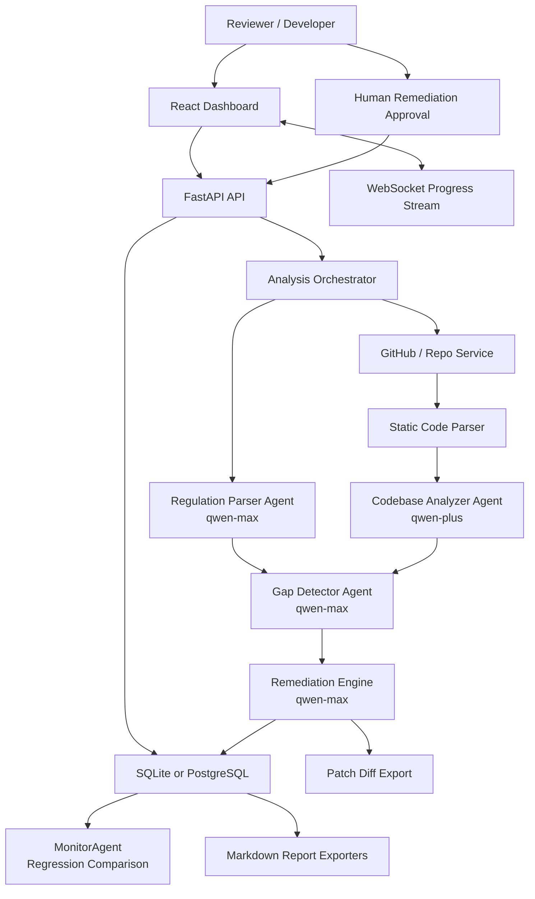
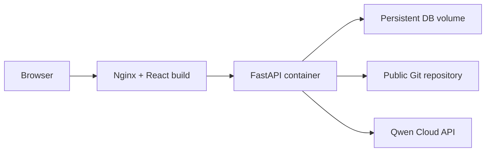

# Compliance Autopilot Architecture

## System Overview

Compliance Autopilot is a FastAPI and React application that runs a Qwen Cloud-powered compliance audit pipeline over a software repository.

## Agent Responsibilities

| Agent | Model | Responsibility |
| --- | --- | --- |
| Regulation Parser | `qwen-max` | Converts regulation text into actionable software requirements. |
| Codebase Analyzer | `qwen-plus` | Synthesizes static parser findings into data models, flows, storage, controls, endpoints, and integrations. |
| Gap Detector | `qwen-max` | Maps requirements to code evidence and assigns compliance status. |
| Remediation Engine | `qwen-max` | Generates implementation guidance and code snippets for unresolved gaps. |
| MonitorAgent | Python service | Compares a completed scan against the previous project scan and flags regressions or resolved gaps. |
| Orchestrator | Python service | Coordinates pipeline stages, persistence, scoring, progress events, and model metadata. |

## Data Flow

1. A reviewer chooses a regulation template and enters a public GitHub repository.
2. FastAPI creates a project and an analysis record.
3. The orchestrator parses or loads regulation requirements.
4. The repository service clones the codebase and lists supported source files.
5. Static analysis extracts PII fields, logging risks, database operations, deletion logic, consent handling, encryption usage, and code structure.
6. Qwen Cloud models synthesize codebase behavior and map legal requirements to source evidence.
7. The remediation engine generates suggested fixes.
8. The app stores gaps, remediation plans, score, Qwen model metadata, token usage, and review state.
9. The reviewer can approve remediation output and export Markdown artifacts.
10. The reviewer can export a unified-diff style patch suggestion and run a regression check against the previous scan.

## Deployment Shape

## Environment Variables

| Variable | Purpose |
| --- | --- |
| `DASHSCOPE_API_KEY` | Qwen Cloud API key. |
| `DATABASE_URL` | SQLAlchemy database URL. Defaults to SQLite for local use. |
| `GITHUB_TOKEN` | Optional token for future private repo support. |

## Hackathon Proof Points

- Qwen model names are saved on each analysis.
- Token usage is recorded when Qwen calls succeed.
- Dashboard and report pages display Qwen Cloud metadata.
- Remediation output has a pending or approved human review state.
- Reports include AI provider, model names, token usage, score, gaps, and remediation plans.
- `/api/deployment-proof` returns Alibaba/Qwen configuration evidence.
- `/api/analysis/demo` creates a one-click seeded scan for live judging.
- Each compliance gap stores the producing agent name.
